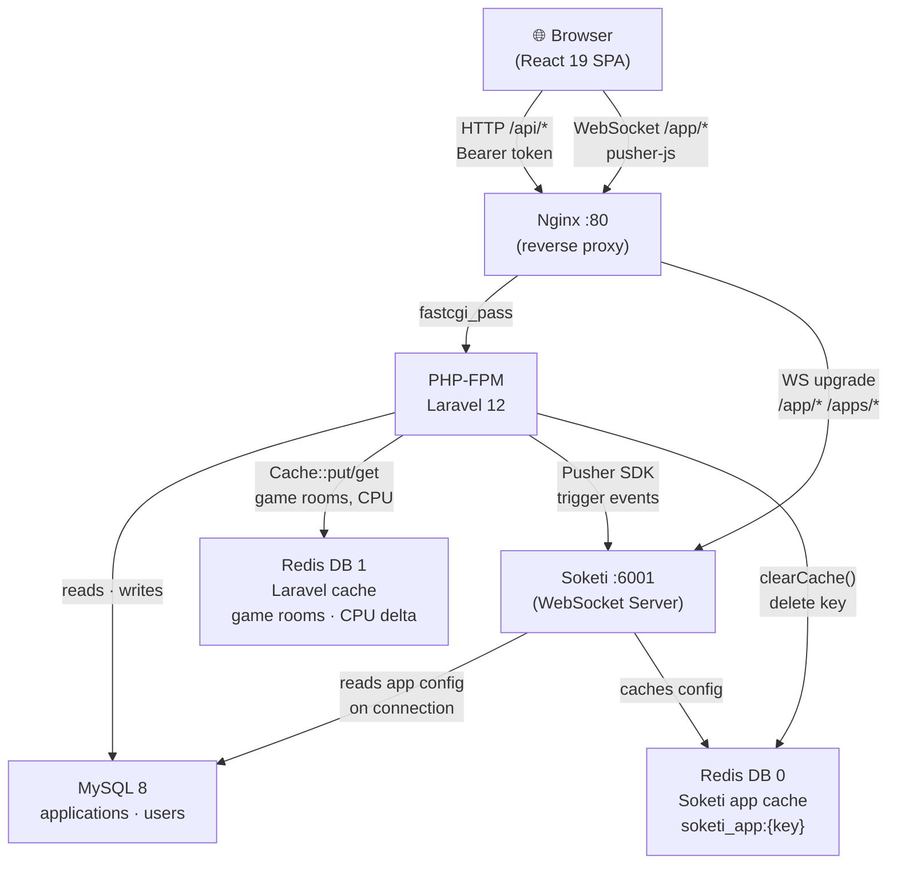
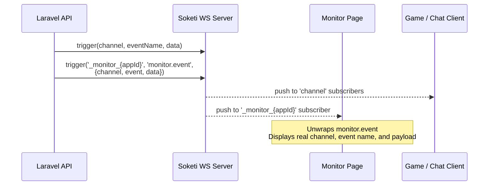
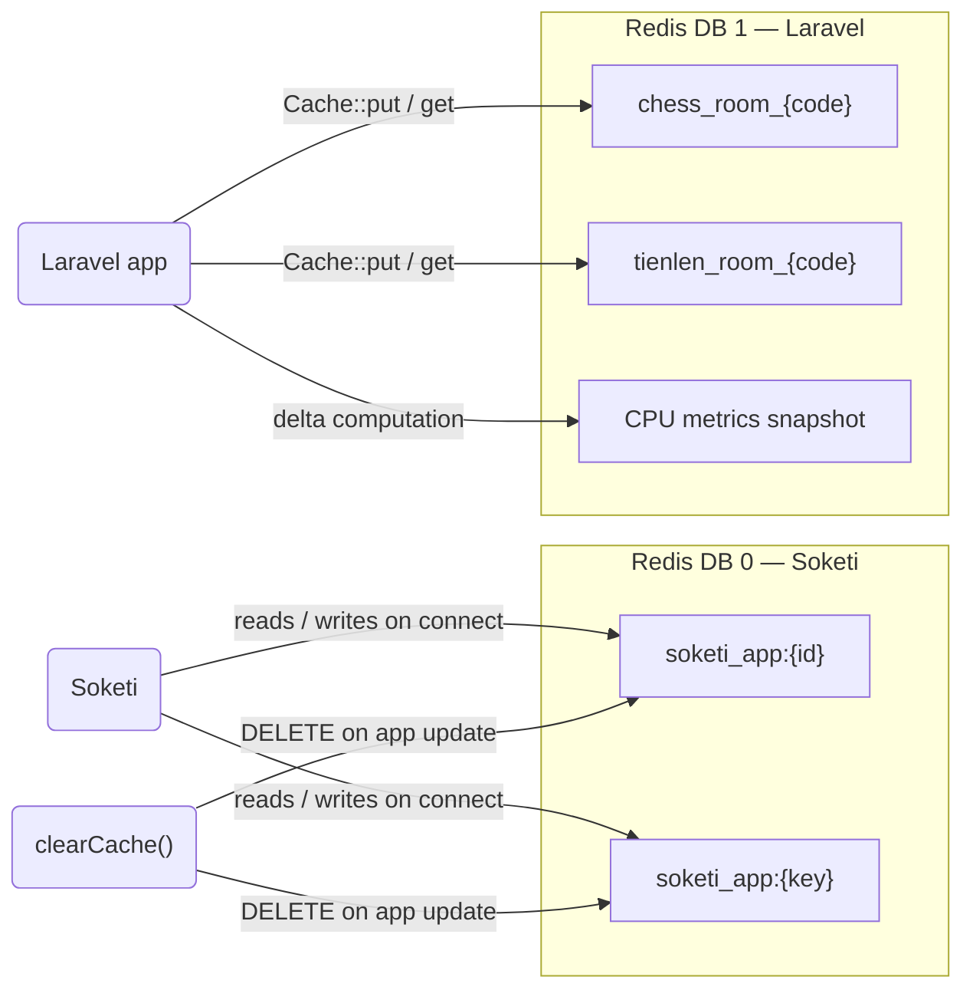
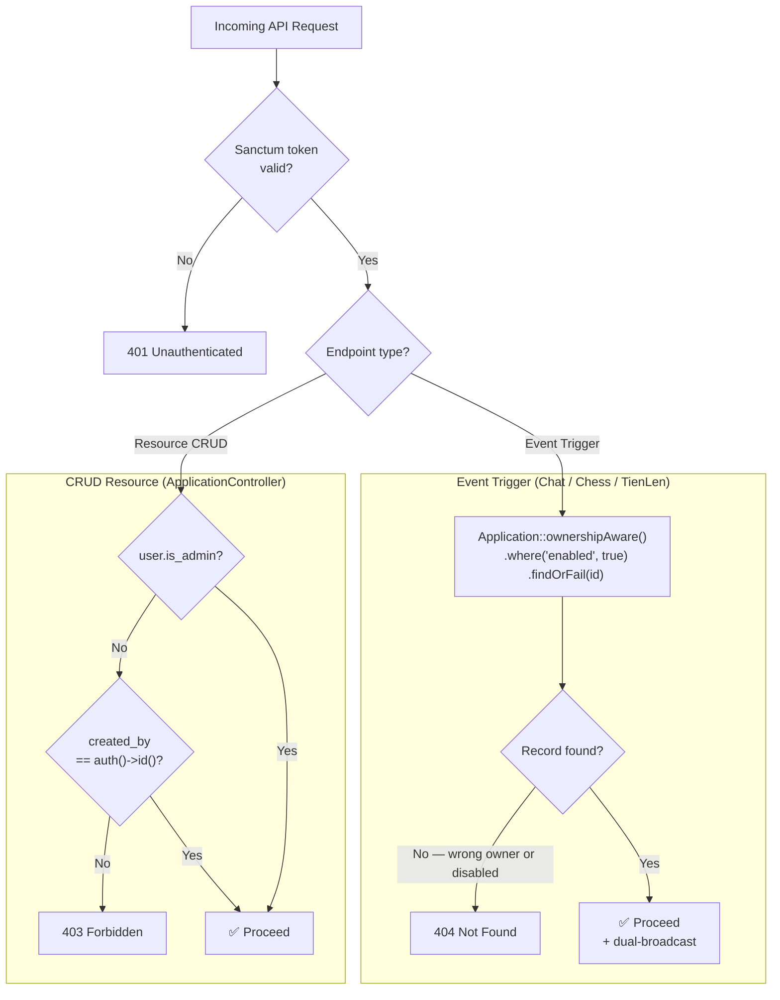
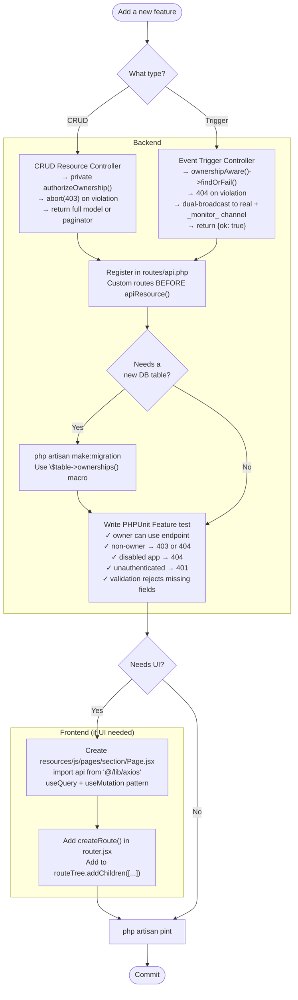

# RealtimePanel

> Self-hosted WebSocket management dashboard for Soketi, Laravel Reverb, and any Pusher-compatible server.
> Built with Laravel 12, React 19, and shadcn/ui.

[](LICENSE)
[](https://php.net)
[](https://laravel.com)
[](https://github.com/kechankrisna/realtime_panel/actions/workflows/ci.yml)

**Keywords:** WebSocket dashboard · Soketi manager · Laravel Reverb admin · self-hosted Pusher alternative · realtime server management · Laravel WebSocket panel

A full-featured management dashboard for [Soketi](https://soketi.app/) — the open-source, self-hosted WebSocket server. Built with **Laravel 12**, **React 19**, **shadcn/ui**, and **TanStack Router/Query**.


---

## Features

### Application Management
- Create, view, edit, delete, and filter Soketi applications
- Toggle application status (enabled / disabled) in one click
- Per-application configuration: connection limits, event rate limits, channel/event name length, payload size, presence member counts
- Interactive webhook management — add, remove, and configure webhook URLs with per-event type filters and custom headers
- Automatic Soketi application cache invalidation on every change

### Live Monitor
- Real-time WebSocket event monitoring at `/applications/:id/monitor`
- Dedicated relay channel (`_monitor_{id}`) receives every triggered event independently of whether other clients are connected
- Collapsible JSON tree viewer for event data
- Filter by event name or channel, Pause / Resume, Clear, Export to JSON
- Stats bar: total events, displayed, events/min, uptime
- Categories: system (pusher:*), internal (pusher_internal:*), client (client-*), server

### Dashboard
- Live Soketi server statistics: active connections, peak connections, socket counts
- JS heap usage gauge with auto-scaling smart status (ok / warning / critical)
- System uptime and resource stats
- Application stats summary

### User Management
- Create and manage users with admin / non-admin roles
- Toggle user active status
- In-app profile editing (name, email, password)

### Galleries — Live Demo Apps
Three fully playable real-time applications included to demonstrate WebSocket capabilities:

| App | Description |
|-----|-------------|
| **Chat** | Real-time group chat — select any app, join any channel, send messages instantly |
| **Chess** | Play vs a minimax AI or challenge another player via a Soketi room code |
| **Tiến Lên** | Vietnamese card game for up to 4 players — play vs bots or host a live room |

All three have a casino-style UI with dark/light mode support.

### Playground
Send arbitrary events to any application channel directly from the browser — useful for testing integrations without writing any code.

### Documentation
Built-in client and server integration guides, pre-filled with your live server connection details.

### Theme
Full light / dark / system theme support persisted to `localStorage`.

---

## Tech Stack

| Layer | Technology |
|-------|-----------|
| Backend | Laravel 12, PHP 8.3+, Laravel Sanctum 4, Pusher PHP Server SDK |
| Frontend | React 19, TanStack Router v1, TanStack Query v5, TanStack Table v8 |
| UI | shadcn/ui, Tailwind CSS 3, Radix UI, Lucide React |
| WebSockets | Soketi, Laravel Echo, pusher-js 8 |
| Database | MySQL 8 or PostgreSQL 13+ |
| Cache / Queue | Redis 7 |
| Build | Vite 5 |
| Runtime | Node.js 20+ (LTS) |
| CI | GitHub Actions (PHP tests, Vitest, Pint) |
| Testing | PHPUnit 11, Vitest, Playwright |

---

## Architecture

### System Overview

The application is a pure React SPA served through Nginx. All API calls go through PHP-FPM (Laravel), while WebSocket connections are proxied directly to Soketi. The Laravel backend triggers events into Soketi using the Pusher PHP SDK, and invalidates Soketi's Redis cache whenever an application's config changes.



### WebSocket Event Flow

Every server-triggered event is **dual-broadcast**: once to the real channel and once to the monitor relay channel `_monitor_{appId}`. This guarantees the Live Monitor always receives events regardless of whether any other client is connected to the original channel.



### Redis Key Layout

Soketi and Laravel use separate Redis databases to avoid key collisions.



---

## Requirements

- Docker & Docker Compose (recommended) **or**
- PHP 8.3+, Composer 2, Node.js 20+ (LTS), MySQL 8 / PostgreSQL 13+, Redis 6+
- Required PHP extensions: `ext-redis`, `ext-pdo`, `ext-mbstring`, `ext-openssl`, `ext-tokenizer`, `ext-xml`, `ext-ctype`, `ext-json`
- A running Soketi instance configured with MySQL/PostgreSQL app manager and Redis caching

---

## Performance on Constrained Hardware (1 GB RAM VM)

> **Note:** The figures below are capacity estimates derived from per-component memory profiling and throughput modelling of the full Docker stack. They are not live benchmark numbers. Actual results will vary with CPU speed, network latency, payload size, and subscriber fan-out.

### Memory Budget

The five Docker containers share the host RAM. With MySQL tuned for a small instance, the full stack fits comfortably inside 1 GB:

| Container | Default RAM | Tuned RAM |
|-----------|-------------|-----------|
| OS + Docker daemon | ~200 MB | ~200 MB |
| `realtime-panel-mysql` | ~450 MB | ~200 MB |
| `realtime-panel` (PHP-FPM × 3 workers) | ~135 MB | ~135 MB |
| `realtime-websocket-server` (Soketi) | ~120 MB | ~120 MB |
| `realtime-panel-redis` | ~25 MB | ~25 MB |
| `realtime-panel-nginx` | ~15 MB | ~15 MB |
| **Total** | **~945 MB ⚠️** | **~695 MB ✅** |

With default MySQL settings the stack brushes the 1 GB ceiling. **MySQL must be tuned** (see below).

### Concurrent WebSocket Connections

Each open WebSocket connection in Soketi consumes roughly **10–15 KB** (Node.js heap entry + Linux kernel socket buffer). With ~120 MB available to Soketi on a 1 GB VM:

| Scenario | Concurrent connections |
|----------|----------------------|
| Theoretical (Soketi memory only) | ~8,000 |
| Practical (full stack, 1 GB VM) | **500 – 1,000 stable** |
| Conservative safe operating point | **≤ 500** |

Beyond ~1,000 connections the Node.js heap grows, OS socket table pressure increases, and MySQL connection overhead from reconnecting clients can cause latency spikes.

### Message / Event Throughput

There are two distinct event paths with very different throughput characteristics:

**1. Server-triggered events** (via the Laravel API — `/api/chat/trigger`, `/api/chess/trigger`, etc.)

Path: Browser → Nginx → PHP-FPM → Laravel → Pusher PHP SDK (HTTP) → Soketi

With 3 PHP-FPM workers on a 1 GB VM:

| Payload size | Estimated throughput |
|---|---|
| ≤ 1 KB | ~150 events / sec |
| 1 – 10 KB | ~100 events / sec |
| 10 – 100 KB | ~30 – 50 events / sec |

**2. Pure Soketi relay** (client → Soketi → subscriber fan-out, no PHP involved)

| Payload size | Estimated throughput |
|---|---|
| ≤ 1 KB | ~5,000 msg / sec |
| 1 – 10 KB | ~3,000 msg / sec |
| 10 – 100 KB | ~500 – 1,000 msg / sec |

### MySQL Tuning for 1 GB

Reduce the InnoDB buffer pool from its 500 MB+ default by passing flags to the MySQL container:

```yaml
# docker-compose.yml — realtime-panel-mysql service
command: >
  --innodb-buffer-pool-size=128M
  --innodb-log-file-size=48M
  --performance-schema=OFF
  --max-connections=50
```

Or via `my.cnf`:

```ini
[mysqld]
innodb_buffer_pool_size  = 128M
innodb_log_file_size     = 48M
performance_schema       = OFF
max_connections          = 50
```

### Scaling Beyond 1 GB

| RAM | Recommended max connections | Notes |
|-----|-----------------------------|-------|
| 1 GB | 500 – 1,000 | MySQL tuning required (see above) |
| 2 GB | 2,000 – 4,000 | Default MySQL settings are fine |
| 4 GB | 8,000 – 15,000 | Increase PHP-FPM workers to 8–10 |
| 8 GB+ | 20,000+ | Consider horizontal Soketi scaling |

---

## Quick Start with Docker

**1. Clone the repository**
```bash
git clone https://github.com/kechankrisna/realtime_panel.git
cd realtime_panel
```

**2. Copy the environment file**
```bash
cp .env.example .env
```
Open `.env` and set `DB_*`, `REDIS_*`, `SUPER_USER_*`, and `SOKETI_*` variables.

**3. Build and start all services**
```bash
docker compose up -d --build
```

**4. Wait for the container to be ready**

On first boot the container automatically runs `composer install` and `npm run build`. This takes **2–3 minutes**. Wait until you see `Starting php-fpm server...`:
```bash
docker compose logs -f realtime-panel | grep -m1 "Starting php-fpm server"
```

**5. Run full setup** (generates app key, runs migrations, links storage, creates super admin)
```bash
docker compose exec realtime-panel php artisan app:setup
```

The stack spins up five containers:

| Container | Role | Port |
|-----------|------|------|
| `realtime-panel` | Laravel + PHP-FPM | — |
| `realtime-panel-nginx` | Nginx reverse proxy | `80` (configurable via `APP_PORT`) |
| `realtime-websocket-server` | Soketi WebSocket server | `6001` (internal) |
| `realtime-panel-mysql` | MySQL 8 database | — (internal) |
| `realtime-panel-redis` | Redis 7 cache / queue | — (internal) |

Open **http://localhost** in your browser.

Default credentials (set via `SUPER_USER_*` in `.env`):
```
Email:    admin@email.com
Password: password
```

---

## Manual Installation (without Docker)

> **macOS prerequisite:** Homebrew PHP does not bundle the Redis extension. Install it before running `composer install`:
> ```bash
> printf "no\nno\nno\n" | pecl install redis
> ```
> The three `no` answers skip optional igbinary/lzf/zstd prompts that would otherwise hang the installer.
> Verify with: `php -r "echo extension_loaded('redis') ? 'redis ok' : 'redis missing';"`

**1. Clone the repo**
```bash
git clone https://github.com/kechankrisna/realtime_panel.git
cd realtime_panel
```

**2. Install PHP dependencies**
```bash
composer install
```

**3. Install JS dependencies**
```bash
npm install
```

**4. Copy and configure environment**
```bash
cp .env.example .env
```
Open `.env` and set `APP_URL`, `DB_*`, `REDIS_*`, `SUPER_USER_*`, `PUSHER_*`, and `SOKETI_*` variables.

**5. Run full setup** (generates app key, runs migrations, links storage, clears cache, creates super admin)
```bash
php artisan app:setup
```

**6. Build frontend assets**
```bash
npm run build
```

**7. Start the development server**
```bash
php artisan serve
```

To run the Soketi WebSocket server alongside the app:

**Install Soketi globally** (first time only)
```bash
npm install -g @soketi/soketi
```
**Start Soketi** (reads config from `.env` `SOKETI_*` variables)
```bash
soketi start
```

> **Updating the super admin later?** Run `php artisan app:update-admin` for an interactive prompt to change the name, email, or password.

## Docker Installation

**Considerations before starting:**

- Port `80` is exposed through nginx by default. Set `APP_PORT` in `.env` before running `docker compose up -d` if there is a conflict.
- Nginx proxies WebSocket connections — no need to expose Soketi port `6001` directly. Use `APP_PORT` for all traffic.
- Set `SUPER_USER_EMAIL` and `SUPER_USER_PASSWORD` in `.env` before running `app:setup` to control the initial admin credentials.
- MySQL and Redis data are stored in **named Docker volumes** (`mysql-data`, `redis-data`) — not in `./docker/data/`. This avoids host filesystem permission issues on Linux.
- On **first boot**, the container automatically runs `composer install` and `npm run build`. Wait ~2–3 minutes before running `app:setup`.

**1. Clone the repo**
```bash
git clone https://github.com/kechankrisna/realtime_panel.git
cd realtime_panel
```

**2. Copy and configure the environment file**
```bash
cp .env.example .env
```
Edit `.env` — set `APP_PORT`, `DB_*`, `REDIS_*`, `SUPER_USER_*`, and `SOKETI_*` variables.

**3. Build and start all containers**
```bash
docker compose up -d --build
```

**4. Wait for the container to be ready**

The container runs `composer install` + `npm run build` on first start. Wait until PHP-FPM is up:
```bash
docker compose logs -f realtime-panel | grep -m1 "Starting php-fpm server"
```

**5. Run full setup inside the container**
(generates app key → runs migrations → links storage → clears cache → creates super admin)
```bash
docker compose exec realtime-panel php artisan app:setup
```

Open **http://localhost** (or the port configured in `APP_PORT`) in your browser.

**Admin credentials** are determined by your `.env`:
```dotenv
SUPER_USER_NAME="Super Admin"
SUPER_USER_EMAIL="admin@email.com"
SUPER_USER_PASSWORD="password"
```

To update the admin's details after deployment, run:
```bash
docker compose exec realtime-panel php artisan app:update-admin
```

---

## Deploying Updates

A `deploy.sh` script is included for pushing code and/or UI updates to a running Docker stack:

```bash
bash deploy.sh
```

This runs, in order:
1. `git pull` — pull latest code
2. `docker compose --profile deploy run --rm deploy` — `npm install` + `npm run build` inside a `node:20-alpine` container
3. `php artisan optimize:clear` — clear all caches
4. `php artisan migrate --force` — apply any new migrations
5. `php artisan optimize` — rebuild config/route/view cache

To rebuild just the frontend assets without pulling code:
```bash
docker compose --profile deploy run --rm deploy
```

---

## Environment Variables

Key variables to configure in `.env`:

```dotenv
APP_NAME="RealtimePanel"
APP_URL=http://localhost
APP_KEY=           # auto-generated by php artisan app:setup (or key:generate)

# CORS & Sanctum — set to your domain when hosting on a subdomain/custom URL
CORS_ALLOWED_ORIGINS="${APP_URL}"
SANCTUM_STATEFUL_DOMAINS=localhost

# Super admin credentials — used by app:setup and app:setup-admin
SUPER_USER_NAME="Super Admin"
SUPER_USER_EMAIL="admin@email.com"
SUPER_USER_PASSWORD="password"

DB_CONNECTION=mysql
DB_HOST=mysql
DB_PORT=3306
DB_DATABASE=realtime_panel
DB_USERNAME=soketi
DB_PASSWORD=password

REDIS_HOST=redis
REDIS_PASSWORD=password
REDIS_PORT=6379

# Soketi connection — used by the PHP backend to trigger events
PUSHER_HOST=soketi        # hostname of the Soketi container
PUSHER_PORT=6001
PUSHER_SCHEME=http
PUSHER_APP_CLUSTER=

# Soketi process settings
SOKETI_APP_MANAGER_DRIVER=mysql
SOKETI_APP_MANAGER_MYSQL_TABLE=applications
SOKETI_DB_MYSQL_HOST=mysql
SOKETI_DB_MYSQL_PORT=3306
SOKETI_DB_MYSQL_USERNAME=soketi
SOKETI_DB_MYSQL_PASSWORD=password
SOKETI_DB_MYSQL_DATABASE=realtime_panel
SOKETI_DB_REDIS_HOST=redis
SOKETI_DB_REDIS_PASSWORD=password
SOKETI_METRICS_ENABLED=true
```

---

## Deploying to Coolify

1. Create a **Docker Compose** application in Coolify and paste the contents of `docker-compose.coolify.yml`.
2. Deploy your preferred **MySQL or PostgreSQL**, **Redis**, and **Soketi** services separately in Coolify.
3. In the **Environment Variables** tab of the RealtimePanel service, fill in all required values including `SUPER_USER_NAME`, `SUPER_USER_EMAIL`, and `SUPER_USER_PASSWORD` — leave `APP_KEY` empty for now.
4. Click **Save** and **Deploy**.
5. Open the service terminal and run:
   ```bash
   # Full setup: key:generate + migrate + storage:link + cache:clear + create super admin
   php artisan app:setup
   ```
6. Copy the generated `APP_KEY` value from the output, set it in the **Environment Variables** tab, and **Restart** the service.

> To update the super admin's credentials after deployment, run `php artisan app:update-admin` from the service terminal.

---

## Development

```bash
# Start Vite dev server (hot reload)
npm run dev

# Build for production
npm run build

# Run PHP unit & feature tests (PHPUnit 11 + SQLite in-memory, no Docker required)
php artisan test

# Run frontend tests (Vitest + jsdom)
npm test

# Run E2E tests (Playwright — requires the Docker stack to be running)
npx playwright install chromium   # first time only
npm run test:e2e

# Run E2E tests including the WebSocket delivery smoke test
E2E_WEBSOCKET=1 npm run test:e2e

# Format PHP code
./vendor/bin/pint

# Clear all caches
php artisan optimize:clear
```

---

## Testing

The project ships with a three-tier test suite.

### PHP Tests (`php artisan test`)

Uses PHPUnit with an **SQLite in-memory** database — no external services needed.

| Suite | Location | What it covers |
|-------|----------|----------------|
| Unit | `tests/Unit/` | `parse_prometheus()` helper, `UserPolicy`, `Application::clearCache()` contract delegation |
| Feature | `tests/Feature/` | All API endpoints — Auth (login/logout/profile), Applications (CRUD + toggle + ownership), Users (CRUD), Config, Chat/Chess/Tiến Lên triggers, Artisan commands |

Key test infrastructure:
- `tests/Concerns/MocksWebSocketServer.php` — swaps the `WebSocketServerContract` binding with a mock/spy so cache-invalidation calls are verified without a Redis connection.
- `database/factories/ApplicationFactory.php` — covers all 20 application columns; `.disabled()` state included.
- `database/factories/UserFactory.php` — `.admin()` and `.inactive()` states.

### Frontend Tests (`npm test`)

Uses **Vitest** + **jsdom** + Testing Library.

| File | What it covers |
|------|----------------|
| `resources/js/tests/lib/utils.test.js` | `cn()` Tailwind merge utility |
| `resources/js/tests/hooks/useAuth.test.js` | `useAuth` hook — login, logout, token persistence, refresh |
| `resources/js/tests/lib/axios.test.js` | Axios `Authorization` header interceptor |

### E2E Tests (`npm run test:e2e`)

Uses **Playwright** (Chromium). Requires the Docker stack (`docker compose up -d`).

| File | What it covers |
|------|----------------|
| `e2e/auth.spec.js` | Login redirect, valid login, wrong password, logout |
| `e2e/applications.spec.js` | Create, view key/secret, toggle enabled state |
| `e2e/users.spec.js` | List, create, delete user via UI |
| `e2e/websocket.spec.js` | Real Soketi message delivery (opt-in: `E2E_WEBSOCKET=1`) |

---

## Developer Guide

### Authorization Flow

Two ownership enforcement patterns exist in the codebase. Using the wrong one for a given endpoint type is a bug — CRUD resources return **403**, event triggers return **404**.



### Contributing — Adding a New Endpoint



---

## API Reference

The backend exposes a RESTful JSON API under `/api`, authenticated via Laravel Sanctum bearer tokens.

| Method | Endpoint | Description |
|--------|----------|-------------|
| `POST` | `/api/auth/login` | Obtain a Sanctum token |
| `POST` | `/api/auth/logout` | Revoke the current token |
| `GET` | `/api/auth/user` | Get the authenticated user |
| `PUT` | `/api/auth/user` | Update profile |
| `GET` | `/api/applications` | List applications (paginated) |
| `POST` | `/api/applications` | Create application |
| `GET` | `/api/applications/{id}` | Get application |
| `PUT` | `/api/applications/{id}` | Update application |
| `DELETE` | `/api/applications/{id}` | Delete application |
| `PATCH` | `/api/applications/{id}/toggle` | Toggle enabled status |
| `GET` | `/api/applications/{id}/channels` | List currently occupied channels |
| `GET` | `/api/applications/stats` | App counts (total / active / inactive) |
| `GET` | `/api/users` | List users (paginated) |
| `POST` | `/api/users` | Create user |
| `PUT` | `/api/users/{id}` | Update user |
| `GET` | `/api/metrics` | Soketi server metrics |
| `GET` | `/api/config` | Public server config (host, port, app name) |
| `POST` | `/api/chat/trigger` | Trigger a chat message event |
| `POST` | `/api/chess/trigger` | Trigger a chess game event |
| `POST` | `/api/tienlen/trigger` | Trigger a Tiến Lên game event |

---

## Monitor Page — How It Works

The Live Monitor at `/applications/:id/monitor` uses Soketi's WebSocket connection directly in the browser. It works via a **dedicated relay channel** pattern:

1. **Backend relay**: Every trigger controller (`ChatController`, `ChessController`, `TienLenController`) fires a second `$pusher->trigger('_monitor_{appId}', 'monitor.event', [...])` message wrapping the original channel, event name, and payload.
2. **Browser subscription**: The monitor page connects with the app's key and subscribes to `_monitor_{id}` — one stable channel that always has at least one subscriber (the monitor itself).
3. **Frame interception**: `ws.onmessage` is patched on `pusher.connection.connection.transport.socket` (the raw WebSocket inside pusher-js) to capture all frames including system events such as `pusher:connection_established` and `pusher_internal:subscription_succeeded`.
4. **Unwrapping**: `monitor.event` frames are unwrapped to display the real channel, real event name, and real data rather than the relay channel name.

This approach means the monitor shows events in real time regardless of whether any other client is connected to the original channel.

---

## Screenshots

### Login


### Dashboard (Dark Mode)


### Dashboard (Light Mode)


### Applications


### Edit Application


### Live Monitor


### Users


### Playground


### Galleries


### Chat Demo


### Chess Demo


### Tiến Lên Card Game


### Client Documentation


### Server Documentation


### Profile


---

## Security

Report security vulnerabilities by email rather than opening a public issue.

---

## License

GNU General Public License v3.0 — see [LICENSE](LICENSE) for details.
