# Soketi Apps

A full-featured management dashboard for [Soketi](https://soketi.app/) — the open-source, self-hosted WebSocket server. Built with **Laravel 10**, **React 19**, **shadcn/ui**, and **TanStack Router/Query**.

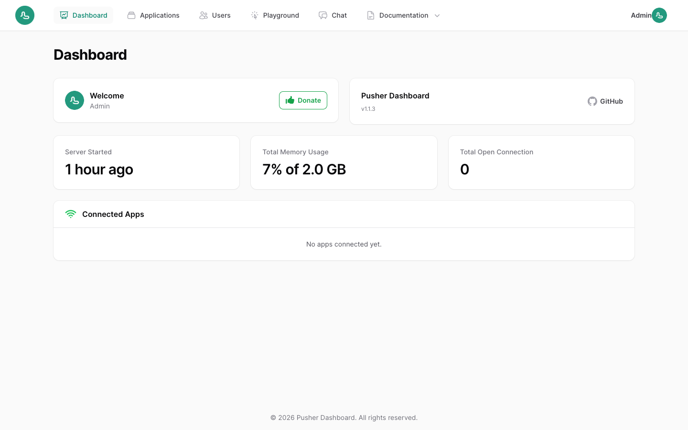

---

## Features

### Application Management
- Create, view, edit, delete, and filter Soketi applications
- Toggle application status (enabled / disabled) in one click
- Per-application configuration: connection limits, event rate limits, channel/event name length, payload size, presence member counts
- Interactive webhook management — add, remove, and configure webhook URLs with per-event type filters and custom headers
- Automatic Soketi application cache invalidation on every change

### Live Monitor
- Real-time WebSocket event monitoring at `/applications/:id/monitor`
- Dedicated relay channel (`_monitor_{id}`) receives every triggered event independently of whether other clients are connected
- Collapsible JSON tree viewer for event data
- Filter by event name or channel, Pause / Resume, Clear, Export to JSON
- Stats bar: total events, displayed, events/min, uptime
- Categories: system (pusher:*), internal (pusher_internal:*), client (client-*), server

### Dashboard
- Live Soketi server statistics: active connections, peak connections, socket counts
- JS heap usage gauge with auto-scaling smart status (ok / warning / critical)
- System uptime and resource stats
- Application stats summary

### User Management
- Create and manage users with admin / non-admin roles
- Toggle user active status
- In-app profile editing (name, email, password)

### Galleries — Live Demo Apps
Three fully playable real-time applications included to demonstrate WebSocket capabilities:

| App | Description |
|-----|-------------|
| **Chat** | Real-time group chat — select any app, join any channel, send messages instantly |
| **Chess** | Play vs a minimax AI or challenge another player via a Soketi room code |
| **Tiến Lên** | Vietnamese card game for up to 4 players — play vs bots or host a live room |

All three have a casino-style UI with dark/light mode support.

### Playground
Send arbitrary events to any application channel directly from the browser — useful for testing integrations without writing any code.

### Documentation
Built-in client and server integration guides, pre-filled with your live server connection details.

### Theme
Full light / dark / system theme support persisted to `localStorage`.

---

## Tech Stack

| Layer | Technology |
|-------|-----------|
| Backend | Laravel 10, PHP 8.1+, Laravel Sanctum, Pusher PHP Server SDK |
| Frontend | React 19, TanStack Router v1, TanStack Query v5, TanStack Table v8 |
| UI | shadcn/ui, Tailwind CSS 3, Radix UI, Lucide React |
| WebSockets | Soketi, Laravel Echo, pusher-js 8 |
| Database | MySQL 8 or PostgreSQL 13+ |
| Cache / Queue | Redis 7 |
| Build | Vite 5 |
| Runtime | Node.js 20+ (LTS) |
| Testing | PHPUnit, Vitest, Playwright |

---

## Requirements

- Docker & Docker Compose (recommended) **or**
- PHP 8.1+, Composer 2, Node.js 20+ (LTS), MySQL 8 / PostgreSQL 13+, Redis 6+
- A running Soketi instance configured with MySQL/PostgreSQL app manager and Redis caching

---

## Quick Start with Docker

```bash
# 1. Clone the repository
git clone https://github.com/kechankrisna/soketi-apps.git
cd soketi-apps

# 2. Copy the environment file and configure your values
cp .env.example .env
# Edit .env — set DB_*, REDIS_*, SUPER_USER_*, and SOKETI_* variables

# 3. Build and start all services
docker compose up -d --build

# 4. Run full setup (migrations + storage link + cache clear + create super admin)
docker compose exec soketi-apps php artisan app:setup
```

The stack spins up five containers:

| Container | Role | Port |
|-----------|------|------|
| `soketi-apps` | Laravel + PHP-FPM | — |
| `soketi-apps-nginx` | Nginx reverse proxy | `80` (configurable via `APP_PORT`) |
| `soketi-websocket-server` | Soketi WebSocket server | `6001` (internal) |
| `soketi-apps-mysql` | MySQL 8 database | — (internal) |
| `soketi-apps-redis` | Redis 7 cache / queue | — (internal) |

Open **http://localhost** in your browser.

Default credentials (set via `SUPER_USER_*` in `.env`):
```
Email:    admin@email.com
Password: password
```

---

## Manual Installation (without Docker)

```bash
# 1. Clone the repo
git clone https://github.com/kechankrisna/soketi-apps.git
cd soketi-apps

# 2. Install PHP dependencies
composer install

# 3. Install JS dependencies
npm install

# 4. Copy and configure environment
cp .env.example .env
# Edit .env — set APP_URL, DB_*, REDIS_*, SUPER_USER_*, PUSHER_*, and SOKETI_* variables

# 5. Run full setup (key:generate + migrate + storage:link + cache:clear + create super admin)
php artisan app:setup

# 6. Build frontend assets
npm run build

# 7. Start the development server
php artisan serve
```

To run the Soketi WebSocket server alongside the app:

```bash
# Install Soketi globally
npm install -g @soketi/soketi

# Start Soketi (reads config from .env SOKETI_* variables)
soketi start
```

> **Updating the super admin later?** Run `php artisan app:update-admin` for an interactive prompt to change the name, email, or password.

## Docker Installation

**Considerations before starting:**

- Port `80` is exposed through nginx by default. Set `APP_PORT` in `.env` before running `docker compose up -d` if there is a conflict.
- Nginx proxies WebSocket connections — no need to expose Soketi port `6001` directly. Use `APP_PORT` for all traffic.
- Set `SUPER_USER_EMAIL` and `SUPER_USER_PASSWORD` in `.env` before running `app:setup` to control the initial admin credentials.

```bash
# 1. Clone or download the repo
git clone https://github.com/kechankrisna/soketi-apps.git
cd soketi-apps

# 2. Copy and configure the environment file
cp .env.example .env
nano .env  # set APP_PORT, DB_*, REDIS_*, SUPER_USER_*, SOKETI_* variables

# 3. Build and start all containers
docker compose up -d --build

# 4. Run full setup inside the container
#    This will: generate app key → migrate DB → link storage → clear cache → create super admin
docker compose exec soketi-apps php artisan app:setup
```

Open **http://localhost** (or the port configured in `APP_PORT`) in your browser.

**Admin credentials** are determined by your `.env`:
```dotenv
SUPER_USER_NAME="Super Admin"
SUPER_USER_EMAIL="admin@email.com"
SUPER_USER_PASSWORD="password"
```

To update the admin's details after deployment, run:
```bash
docker compose exec soketi-apps php artisan app:update-admin
```

---

## Environment Variables

Key variables to configure in `.env`:

```dotenv
APP_NAME="Soketi Apps"
APP_URL=http://localhost
APP_KEY=           # auto-generated by php artisan app:setup (or key:generate)

# Super admin credentials — used by app:setup and app:setup-admin
SUPER_USER_NAME="Super Admin"
SUPER_USER_EMAIL="admin@email.com"
SUPER_USER_PASSWORD="password"

DB_CONNECTION=mysql
DB_HOST=mysql
DB_PORT=3306
DB_DATABASE=soketi_apps
DB_USERNAME=soketi
DB_PASSWORD=password

REDIS_HOST=redis
REDIS_PASSWORD=password
REDIS_PORT=6379

# Soketi connection — used by the PHP backend to trigger events
PUSHER_HOST=soketi        # hostname of the Soketi container
PUSHER_PORT=6001
PUSHER_SCHEME=http
PUSHER_APP_CLUSTER=

# Soketi process settings
SOKETI_APPS_DRIVER=mysql
SOKETI_APPS_MYSQL_TABLE=applications
SOKETI_DB_MYSQL_HOST=mysql
SOKETI_DB_MYSQL_PORT=3306
SOKETI_DB_MYSQL_USERNAME=soketi
SOKETI_DB_MYSQL_PASSWORD=password
SOKETI_DB_MYSQL_DATABASE=soketi_apps
SOKETI_DB_REDIS_HOST=redis
SOKETI_DB_REDIS_PASSWORD=password
SOKETI_METRICS_ENABLED=true
```

---

## Deploying to Coolify

1. Create a **Docker Compose** application in Coolify and paste the contents of `docker-compose.coolify.yml`.
2. Deploy your preferred **MySQL or PostgreSQL**, **Redis**, and **Soketi** services separately in Coolify.
3. In the **Environment Variables** tab of the Soketi Apps service, fill in all required values including `SUPER_USER_NAME`, `SUPER_USER_EMAIL`, and `SUPER_USER_PASSWORD` — leave `APP_KEY` empty for now.
4. Click **Save** and **Deploy**.
5. Open the service terminal and run:
   ```bash
   # Full setup: key:generate + migrate + storage:link + cache:clear + create super admin
   php artisan app:setup
   ```
6. Copy the generated `APP_KEY` value from the output, set it in the **Environment Variables** tab, and **Restart** the service.

> To update the super admin's credentials after deployment, run `php artisan app:update-admin` from the service terminal.

---

## Development

```bash
# Start Vite dev server (hot reload)
npm run dev

# Build for production
npm run build

# Run PHP unit & feature tests (SQLite in-memory, no Docker required)
php artisan test

# Run frontend tests (Vitest + jsdom)
npm test

# Run E2E tests (Playwright — requires the Docker stack to be running)
npx playwright install chromium   # first time only
npm run test:e2e

# Run E2E tests including the WebSocket delivery smoke test
E2E_WEBSOCKET=1 npm run test:e2e

# Format PHP code
./vendor/bin/pint

# Clear all caches
php artisan optimize:clear
```

---

## Testing

The project ships with a three-tier test suite.

### PHP Tests (`php artisan test`)

Uses PHPUnit with an **SQLite in-memory** database — no external services needed.

| Suite | Location | What it covers |
|-------|----------|----------------|
| Unit | `tests/Unit/` | `parse_prometheus()` helper, `UserPolicy`, `Application::clearCache()` contract delegation |
| Feature | `tests/Feature/` | All API endpoints — Auth (login/logout/profile), Applications (CRUD + toggle + ownership), Users (CRUD), Config, Chat/Chess/Tiến Lên triggers, Artisan commands |

Key test infrastructure:
- `tests/Concerns/MocksWebSocketServer.php` — swaps the `WebSocketServerContract` binding with a mock/spy so cache-invalidation calls are verified without a Redis connection.
- `database/factories/ApplicationFactory.php` — covers all 20 application columns; `.disabled()` state included.
- `database/factories/UserFactory.php` — `.admin()` and `.inactive()` states.

### Frontend Tests (`npm test`)

Uses **Vitest** + **jsdom** + Testing Library.

| File | What it covers |
|------|----------------|
| `resources/js/tests/lib/utils.test.js` | `cn()` Tailwind merge utility |
| `resources/js/tests/hooks/useAuth.test.js` | `useAuth` hook — login, logout, token persistence, refresh |
| `resources/js/tests/lib/axios.test.js` | Axios `Authorization` header interceptor |

### E2E Tests (`npm run test:e2e`)

Uses **Playwright** (Chromium). Requires the Docker stack (`docker compose up -d`).

| File | What it covers |
|------|----------------|
| `e2e/auth.spec.js` | Login redirect, valid login, wrong password, logout |
| `e2e/applications.spec.js` | Create, view key/secret, toggle enabled state |
| `e2e/users.spec.js` | List, create, delete user via UI |
| `e2e/websocket.spec.js` | Real Soketi message delivery (opt-in: `E2E_WEBSOCKET=1`) |

---

## API Reference

The backend exposes a RESTful JSON API under `/api`, authenticated via Laravel Sanctum bearer tokens.

| Method | Endpoint | Description |
|--------|----------|-------------|
| `POST` | `/api/auth/login` | Obtain a Sanctum token |
| `POST` | `/api/auth/logout` | Revoke the current token |
| `GET` | `/api/auth/user` | Get the authenticated user |
| `PUT` | `/api/auth/user` | Update profile |
| `GET` | `/api/applications` | List applications (paginated) |
| `POST` | `/api/applications` | Create application |
| `GET` | `/api/applications/{id}` | Get application |
| `PUT` | `/api/applications/{id}` | Update application |
| `DELETE` | `/api/applications/{id}` | Delete application |
| `PATCH` | `/api/applications/{id}/toggle` | Toggle enabled status |
| `GET` | `/api/applications/{id}/channels` | List currently occupied channels |
| `GET` | `/api/applications/stats` | App counts (total / active / inactive) |
| `GET` | `/api/users` | List users (paginated) |
| `POST` | `/api/users` | Create user |
| `PUT` | `/api/users/{id}` | Update user |
| `GET` | `/api/metrics` | Soketi server metrics |
| `GET` | `/api/config` | Public server config (host, port, app name) |
| `POST` | `/api/chat/trigger` | Trigger a chat message event |
| `POST` | `/api/chess/trigger` | Trigger a chess game event |
| `POST` | `/api/tienlen/trigger` | Trigger a Tiến Lên game event |

---

## Monitor Page — How It Works

The Live Monitor at `/applications/:id/monitor` uses Soketi's WebSocket connection directly in the browser. It works via a **dedicated relay channel** pattern:

1. **Backend relay**: Every trigger controller (`ChatController`, `ChessController`, `TienLenController`) fires a second `$pusher->trigger('_monitor_{appId}', 'monitor.event', [...])` message wrapping the original channel, event name, and payload.
2. **Browser subscription**: The monitor page connects with the app's key and subscribes to `_monitor_{id}` — one stable channel that always has at least one subscriber (the monitor itself).
3. **Frame interception**: `ws.onmessage` is patched on `pusher.connection.connection.transport.socket` (the raw WebSocket inside pusher-js) to capture all frames including system events such as `pusher:connection_established` and `pusher_internal:subscription_succeeded`.
4. **Unwrapping**: `monitor.event` frames are unwrapped to display the real channel, real event name, and real data rather than the relay channel name.

This approach means the monitor shows events in real time regardless of whether any other client is connected to the original channel.

---

## Screenshots

### Login
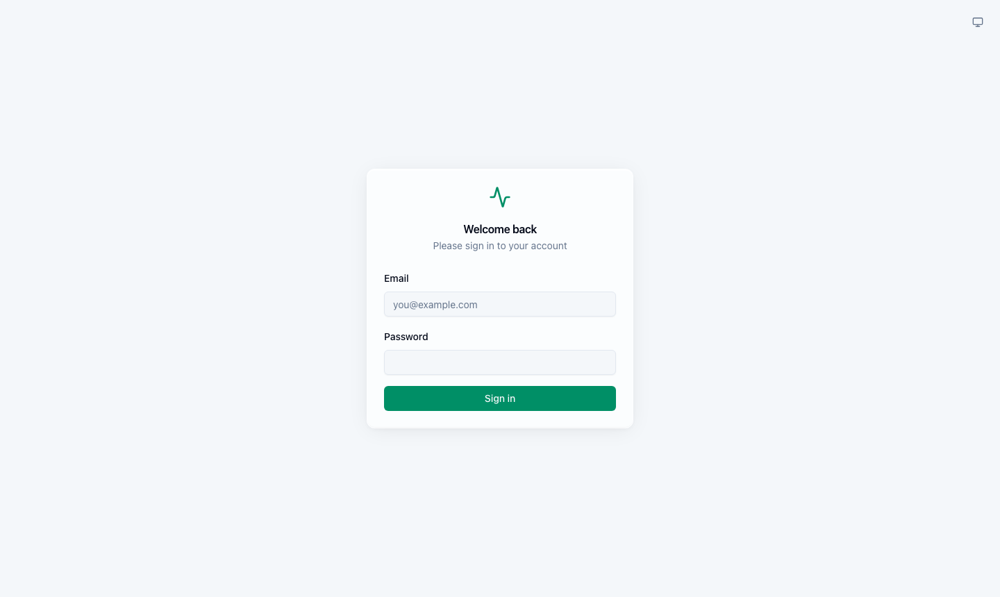

### Dashboard (Dark Mode)


### Dashboard (Light Mode)
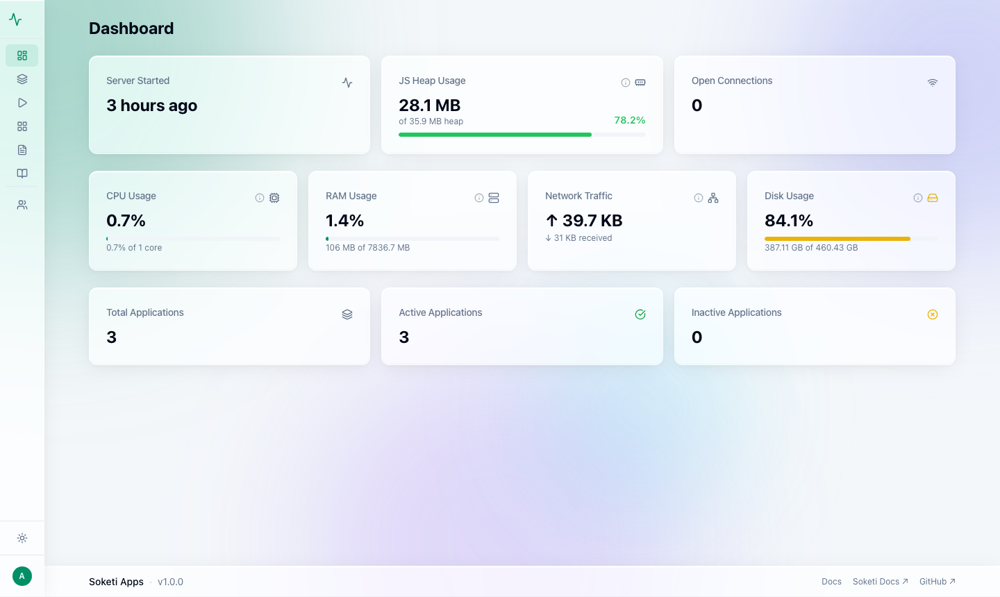

### Applications
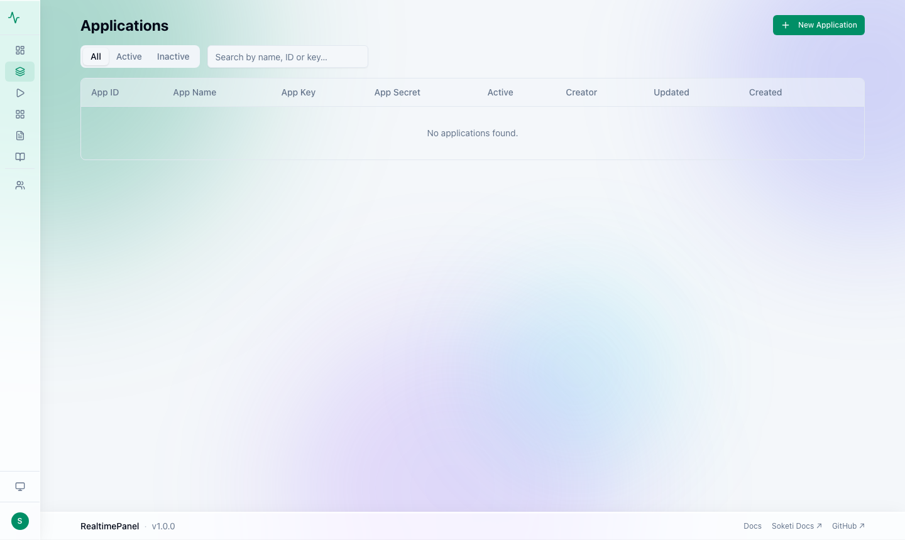

### Edit Application
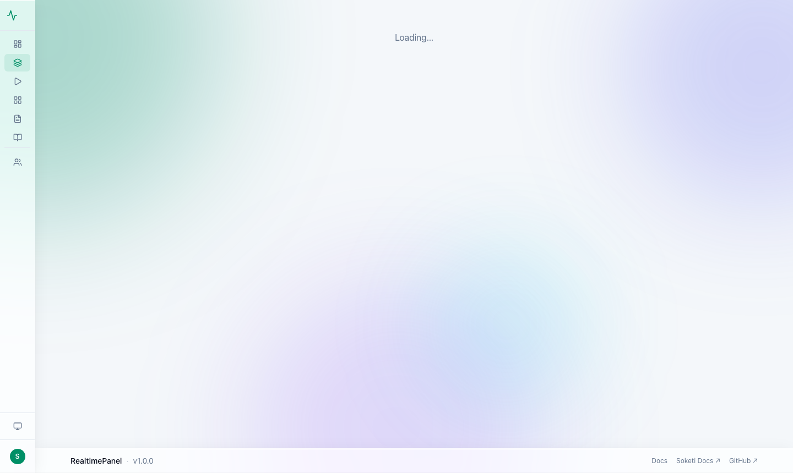

### Live Monitor
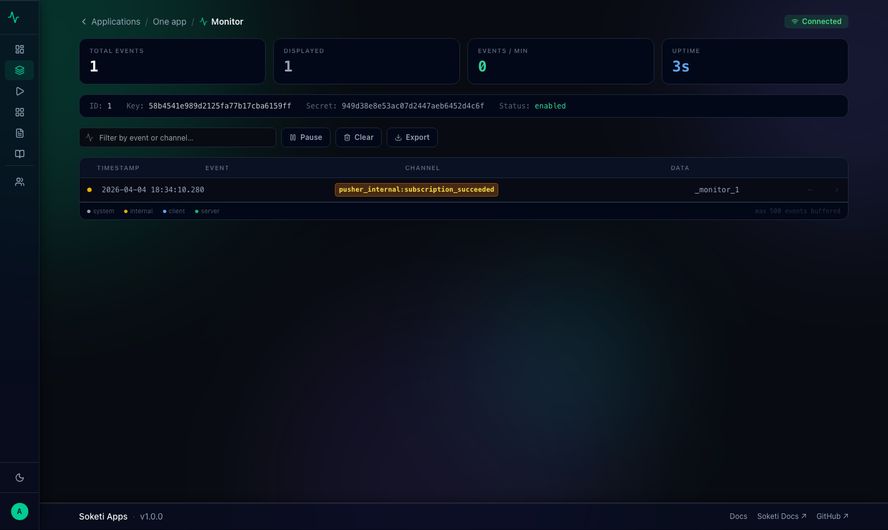

### Users
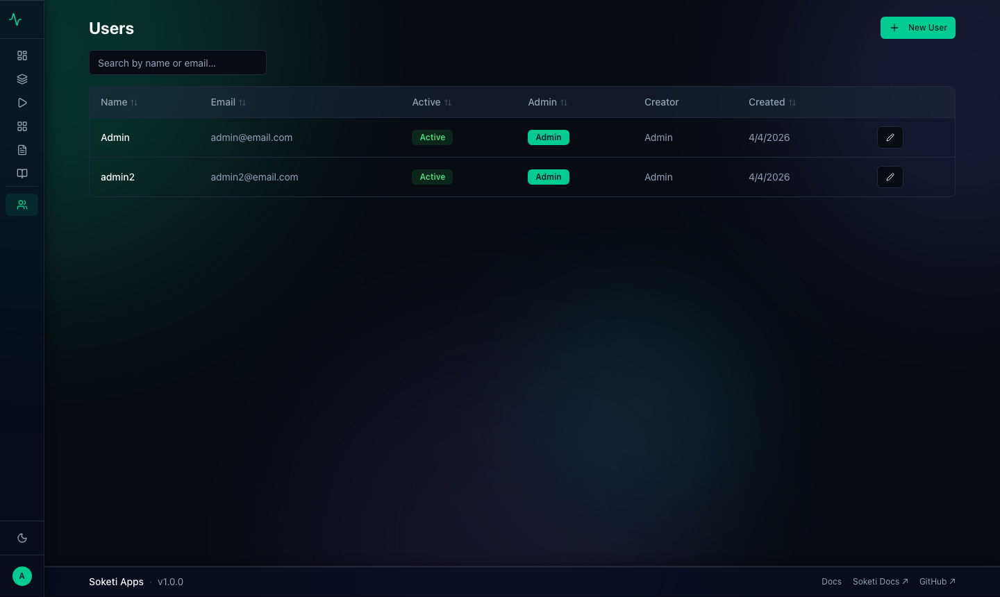

### Playground
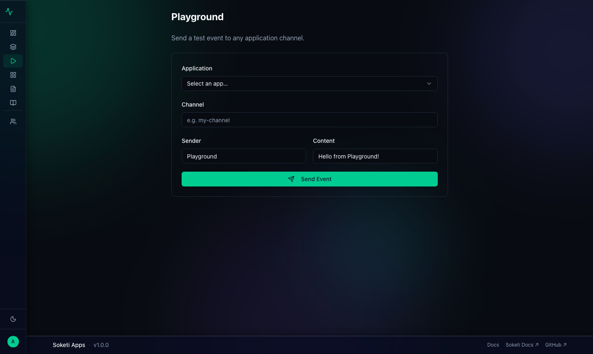

### Galleries
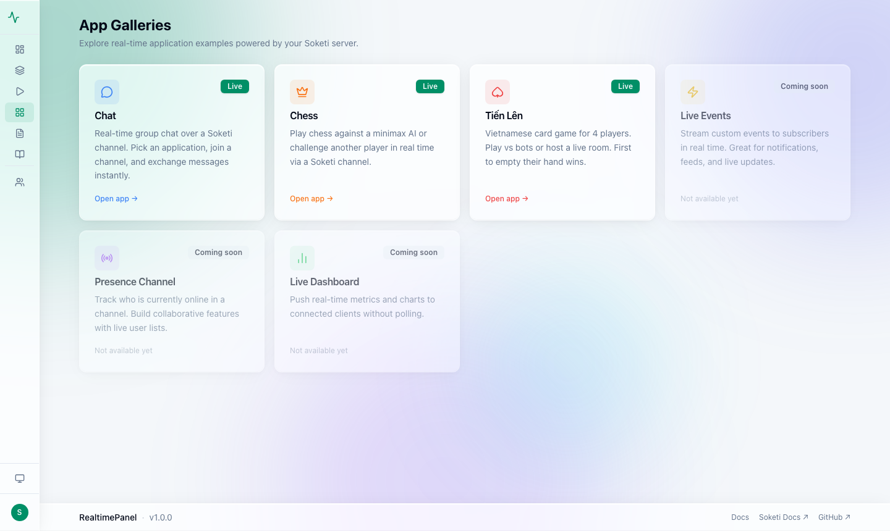

### Chat Demo
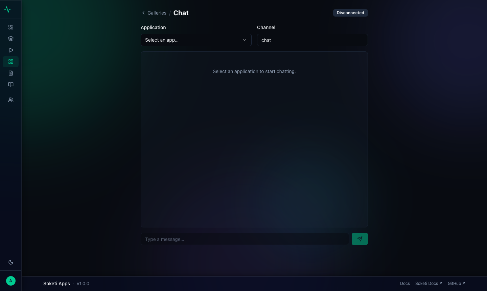

### Chess Demo
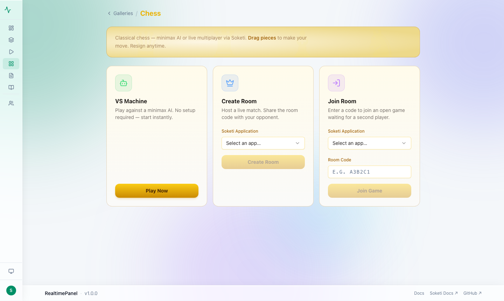

### Tiến Lên Card Game
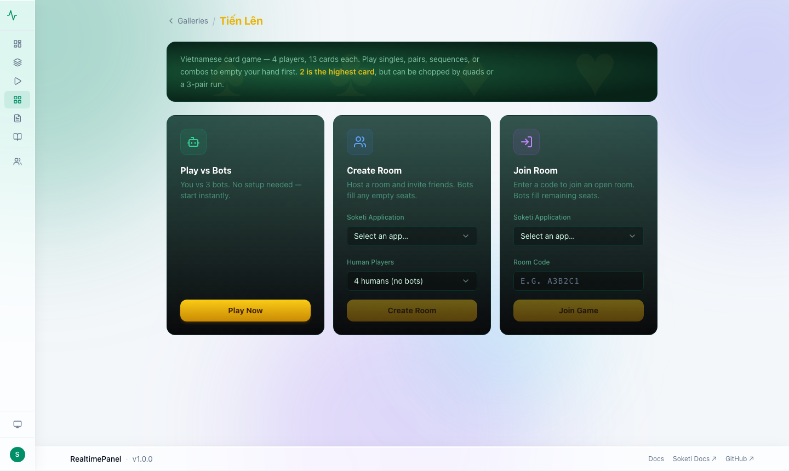

### Client Documentation
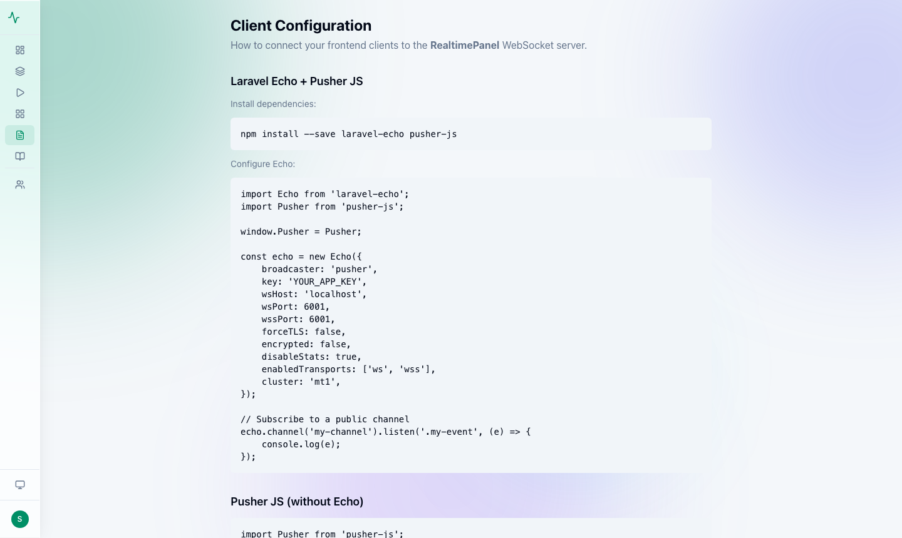

### Server Documentation
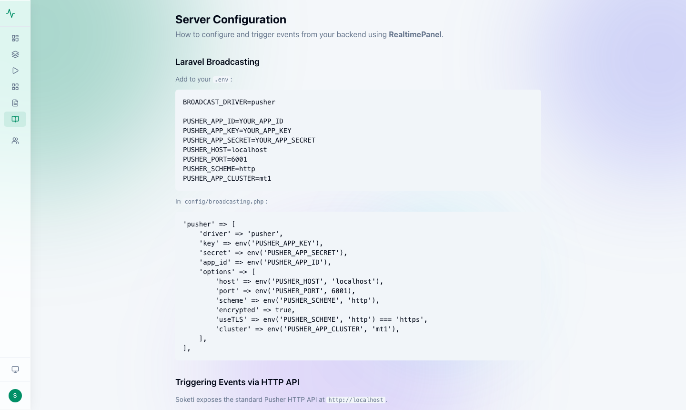

### Profile
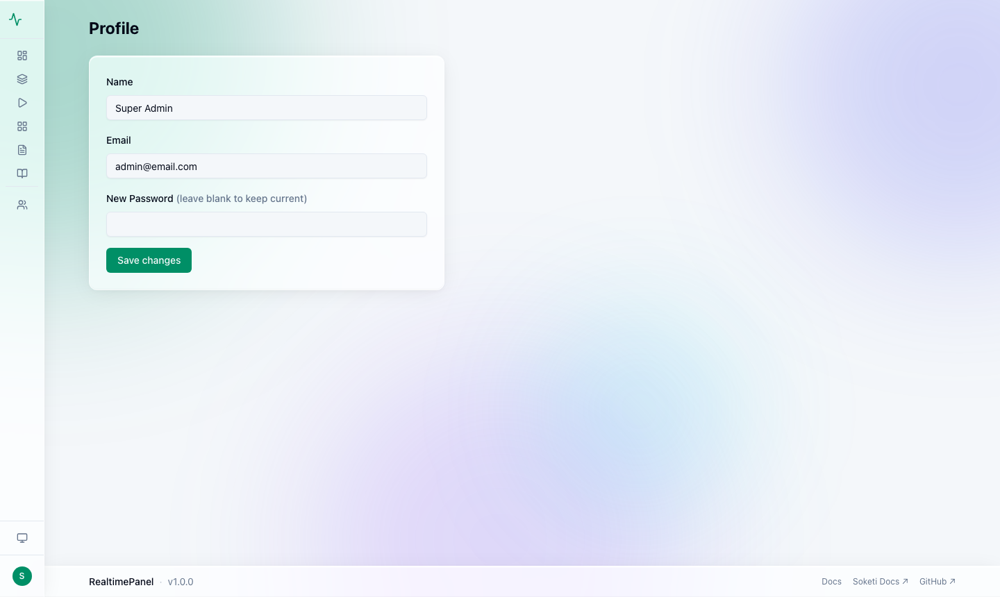

---

## Security

Report security vulnerabilities by email rather than opening a public issue.

---

## License

GNU General Public License v3.0 — see [LICENSE](LICENSE) for details.
